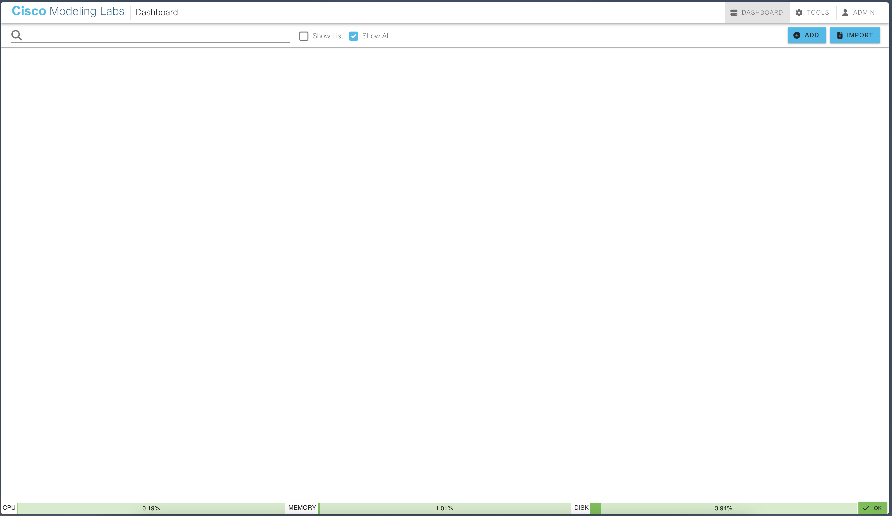
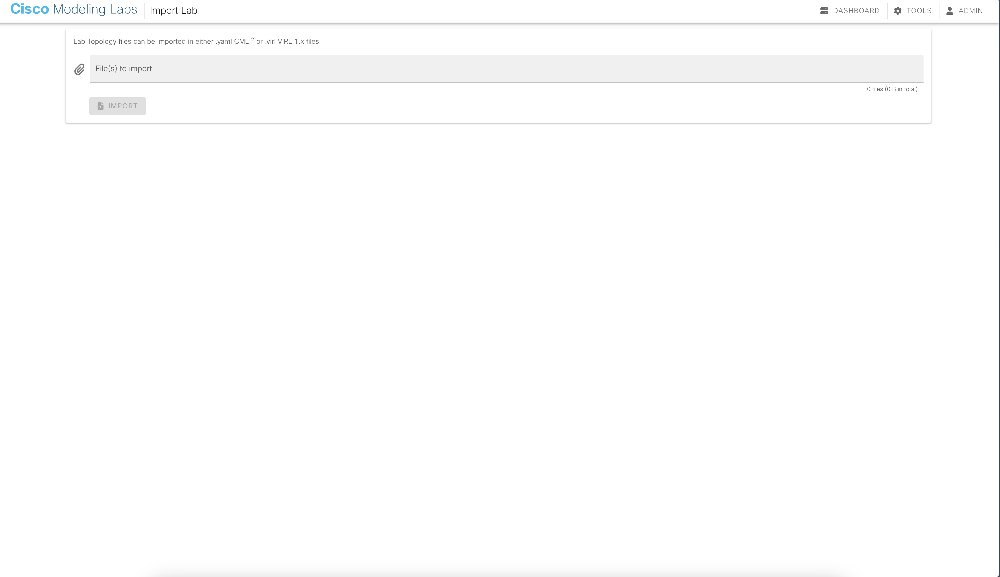
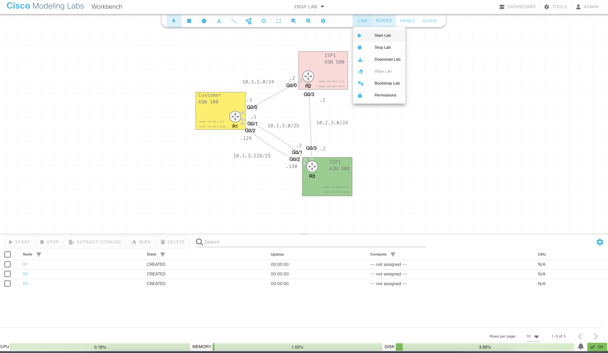
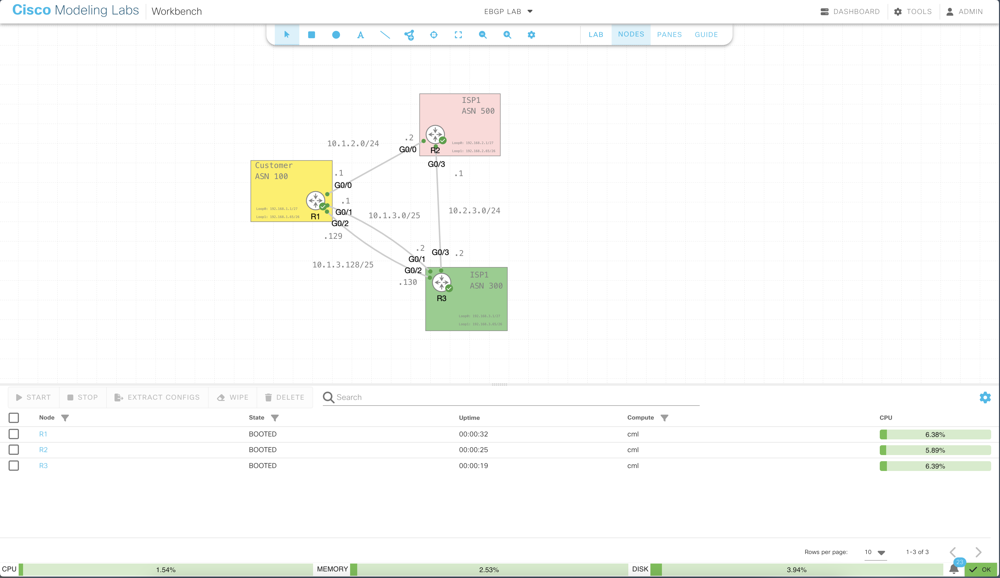
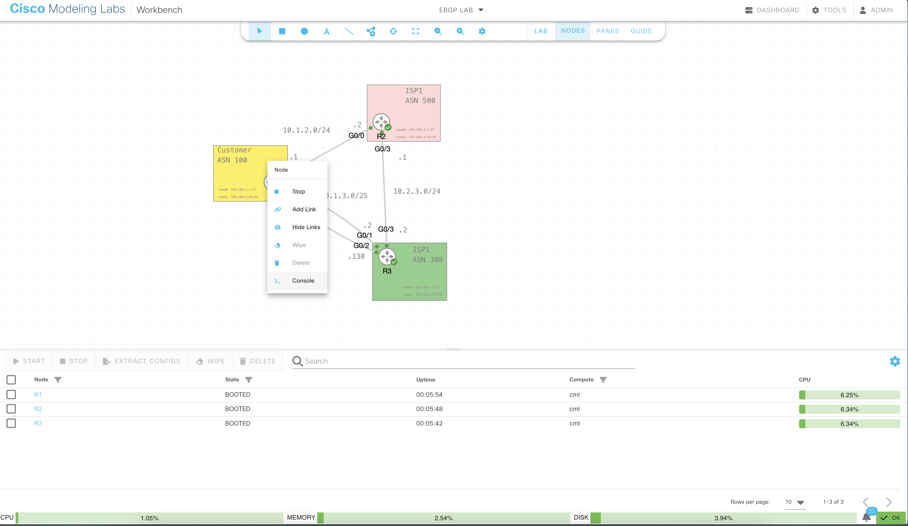

# Cisco ENCOR v1.1 Practice Labs
A collection of guided practice labs and solutions for the Cisco 350-401 ENCOR v1.1 exam.


## About the exam
According to Cisco's official **[certification listing](https://learningnetwork.cisco.com/s/ccnp-enterprise)**,
> (ENCOR 350-401) is a 120-minute exam associated with the CCNP and CCIE Enterprise Certifications. This exam tests a candidate's knowledge of implementing core enterprise network technologies, including dual stack (IPv4 and IPv6) architecture, virtualization, infrastructure, network assurance, security, and automation.

The exam itself consists of multiple choice, drag & drop, and hands-on lab questions.
It will behoove you to read the **[exam topics](https://learningnetwork.cisco.com/s/encor-exam-topics)** closely to get a sense of the level of depth required for each topic.

 
> ### Tip: Verbs matter!
>
> Topics starting with **Configure**, **Troubleshoot**, or **Verify** are likely to require configuration-level knowledge, whereas **Explain**, for instance, is more likely to appear as a multiple choice or drag & drop question.

Keep in mind that while some topics may not show up as labs, you may still encounter configuration files or show commands as part of a multiple choice question.
That is to say, as much as possible... **lab, lab, lab!**


## What's in a lab?
Each lab contains:
- A respective Lab folder with:
    - A .yaml file for importing the starting configuration into CML.
    - A .md file with instructions for completing the lab.

- A respective Solution folder with:
    - A .yaml file representing a correctly configured lab state. (auto-grader work in progress!)
    - A .md file with answers to the lab instructions.


## How to Use
These labs are built for Cisco CML v2.6 and assume you have a running instance.
This is not a trivial assumption, but if you don't have a local instance, consider reserving a free CML instance (as well as many other Cisco solutions) on [Cisco's DevNet Sandbox](https://developer.cisco.com/sandbox.html?ReturnUrl=https://devnetsandbox.cisco.com)!

### 1. Clone the repository locally via:

    ```git clone https://github.com/neythonstreitz/encor-problem-sets.git```

*Alternatively, you can view the instructions from the Github website and download individual lab .yaml files. Only the .yaml file is necessary for the lab to load in CML, so locally cloning the repo is not required (for now).*

### 2. Navigate to your CML server via a web browser.

### 3. In the top right, click on ```Import```.

### 4. Choose your selected lab.yaml file and select ```Import```. Once loaded, press ```Go To Lab```.
### 5. Within the lab environment, start the lab devices all at once by navigating to ```Lab``` and selecting ```Start Lab```.


*Get some coffee... this step may take a few minutes...*
### 6. The nodes are ready when a green checkmark appears and the ```Nodes``` pane shows a ```BOOTED``` state for all nodes.



### 7. To open a device console, right click the node and select ```CONSOLE```


*The device console should appear at the bottom of the screen.*

### 8. Follow the lab instructions and repeat the process for other topics!

